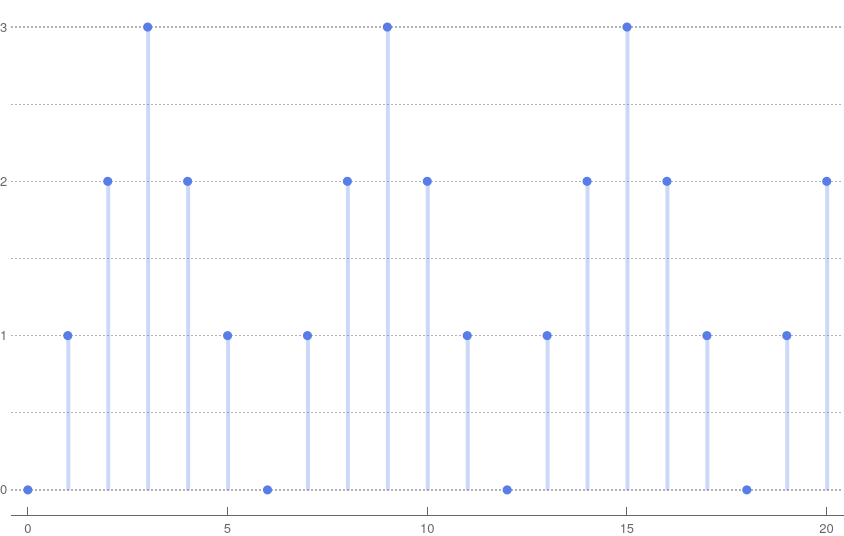

# Bounce

Define a function with type:
```ocaml
bounce : int -> int -> int
```
The function takes as input an integer, and it outputs
a function from integers to integers.
The output function `bounce n` is periodic with period 2 n,
and it has the behaviour described by the following graph (with n=3).



